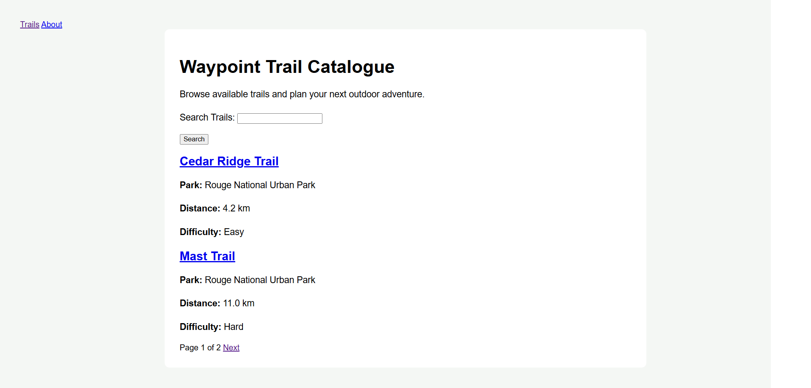
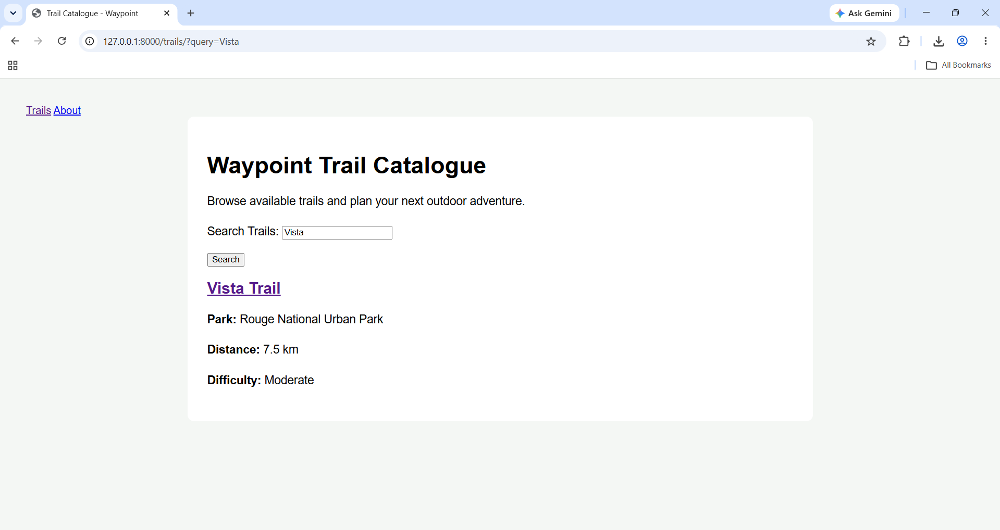
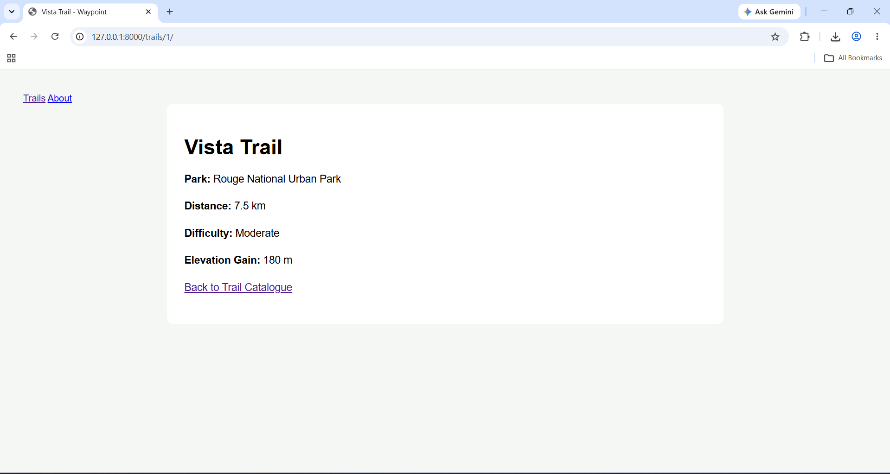
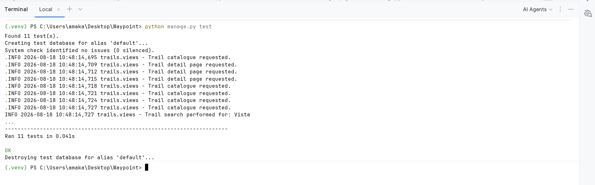
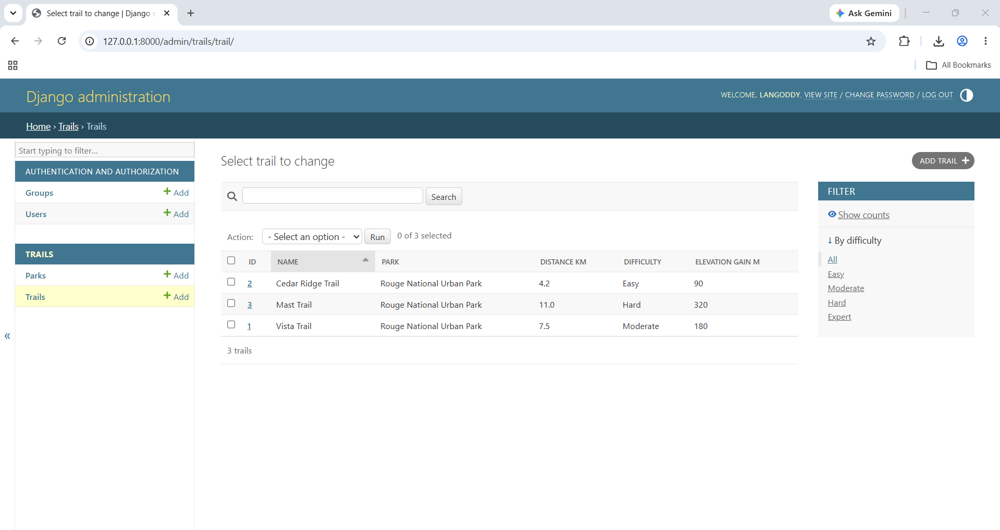

# Waypoint

Waypoint is a Python and Django trail-finder and trip-planner application developed as part of my Application Programming coursework.

The project began as a Python object-oriented programming application and was progressively developed into a Django web application using database models, templates, forms, search, pagination, automated testing, performance optimization, logging, and a professional Git/GitHub workflow.

---

## Project Features

Waypoint currently includes:

- Python object-oriented domain models
- Distance unit conversion
- Trail validation
- Trail inheritance and polymorphism
- Operator overloading
- Django web application
- Park and Trail database models
- Django ORM
- Django Admin
- Trail catalogue
- Individual trail detail pages
- Trail search
- Pagination
- Open and closed trail management
- Automated Django tests
- Query optimization
- Application logging
- Static CSS styling

---

## Technologies Used

- Python
- Django
- SQLite
- HTML
- CSS
- Git
- GitHub
- PyCharm

---

## Project Structure

```text
Waypoint/
│
├── distance.py
├── itinerary.py
├── trail.py
├── main.py
├── manage.py
├── README.md
│
├── screenshots/
│   ├── trail-catalogue.png
│   ├── trail-search.png
│   ├── trail-detail.png
│   ├── automated-tests.png
│   └── django-admin.png
│
├── trails/
│   ├── migrations/
│   ├── static/
│   ├── templates/
│   ├── admin.py
│   ├── apps.py
│   ├── forms.py
│   ├── models.py
│   ├── tests.py
│   ├── urls.py
│   └── views.py
│
└── waypoint/
    ├── settings.py
    ├── urls.py
    ├── asgi.py
    └── wsgi.py
```

---

## Python Domain Model

The original Python portion of Waypoint demonstrates object-oriented programming concepts including:

- Classes and objects
- Encapsulation
- Validation
- Inheritance
- Abstract base classes
- Mixins
- Polymorphism
- Operator overloading
- Equality comparison
- Unit conversion

The `Distance` class supports distance validation and unit conversion.

The trail hierarchy includes different trail types such as:

- Day hikes
- Backpacking routes
- Trail runs
- Guided day hikes

---

## Django Application

The Django portion of Waypoint stores parks and trails in a database.

Each Trail belongs to a Park and contains information such as:

- Trail name
- Distance
- Difficulty
- Elevation gain
- Open/closed status

Only trails marked as open are available through the public trail catalogue.

---

## Trail Search

Users can search for trails by name from the trail catalogue.

For example, searching for:

```text
Vista
```

returns trails whose names contain the word `Vista`.

---

## Pagination

The trail catalogue uses pagination so that the application does not display every trail on a single page.

Waypoint currently displays two trails per page for demonstration purposes.

Search terms are preserved while navigating between search-result pages.

---

## Performance Optimization

Waypoint uses Django's `select_related()` when retrieving Trail and Park information.

This allows Django to retrieve the related Park together with its Trail instead of performing unnecessary additional database queries.

Trail querysets are also ordered consistently before pagination.

---

## Logging

Python and Django logging are configured for the `trails` application.

The application records INFO messages for activities including:

- Trail catalogue requests
- Trail searches
- Trail detail requests
- About page requests

During development, these messages are displayed in the terminal.

---

## Automated Testing

Waypoint includes automated tests for the Python domain rules and Django application.

The test suite currently contains 11 tests covering areas such as:

- Park string representation
- Trail string representation
- Trail catalogue response
- Trail catalogue content
- Trail search
- Pagination
- Trail detail response
- Trail detail content
- Open-trail filtering
- Invalid trail detail URLs returning HTTP 404
- Negative Distance values being rejected

Run the complete test suite with:

```bash
python manage.py test
```

A successful test run should finish with:

```text
Ran 11 tests
OK
```

---

## Installation and Setup

### 1. Clone the repository

```bash
git clone https://github.com/LANgoddy/Waypoint.git
```

### 2. Enter the project directory

```bash
cd Waypoint
```

### 3. Create a virtual environment

On Windows:

```bash
python -m venv .venv
```

### 4. Activate the virtual environment

Using PowerShell:

```powershell
.venv\Scripts\Activate.ps1
```

### 5. Install Django

```bash
pip install django
```

### 6. Apply database migrations

```bash
python manage.py migrate
```

### 7. Run the automated tests

```bash
python manage.py test
```

### 8. Start the development server

```bash
python manage.py runserver
```

The terminal will display the local development server address.

---

## Application Routes

### Trail Catalogue

```text
/trails/
```

Displays the public catalogue of open trails.

### Trail Detail

```text
/trails/<id>/
```

Displays information about an individual open trail.

Example:

```text
/trails/1/
```

### About

```text
/about/
```

Displays information about the Waypoint application.

### Django Admin

```text
/admin/
```

Provides administrative management of Park and Trail records.

---

## Admin Features

The Django Admin interface can be used to:

- Create parks
- Create trails
- Edit trails
- Delete trails
- Change trail difficulty
- Change open/closed status
- Search and filter trail records

---

## Running the Application

Start the server with:

```bash
python manage.py runserver
```

Then open the trail catalogue using the local server address followed by:

```text
/trails/
```

---

## Git and GitHub Workflow

Development was completed using feature branches for each stage of the project.

Branches included:

- `week-07-domain-model`
- `week-08-hierarchy-and-operators`
- `week-09-django-foundation`
- `week-10-models-orm-admin`
- `week-11-cbv-templates-static`
- `week-12-forms-search-pagination`
- `week-13-tests-perf-logging`
- `week-14-hardening-and-handoff`

Each development stage was committed separately and integrated through the Git/GitHub workflow.

Version tags were also created for the completed project stages.

---

## Screenshots

The following screenshots demonstrate the completed Waypoint application.

### Trail Catalogue



### Trail Search



### Trail Detail Page



### Automated Tests



### Django Admin



---

## Final Release

The completed Waypoint project will be published as:

```text
v1.0
```

This release represents the final hardened and documented version of the application.

---

## Author

Lucia Ngoddy
